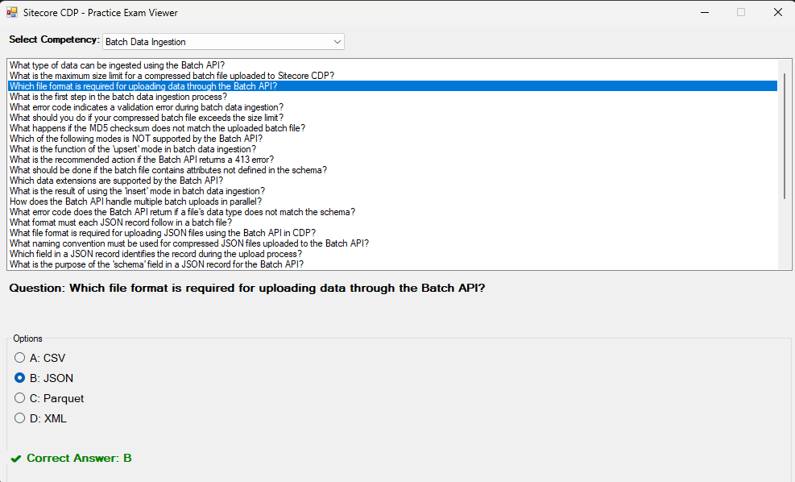

# 🧠 Sitecore CDP Practice Exam Viewer

A simple **.NET Framework Windows Forms application** that fetches and displays Sitecore CDP practice exam questions from a remote JSON endpoint.  
You can filter questions by **competency**, view their **options**, and reveal the **correct answer** interactively.

A big thank you to [Gabriel Streza](https://streza.dev) who first implemented the same as a web app. You can checkout the web app version at [Sitecore CDP Certification Practice Exams](https://streza.dev/sitecore-cdp-practice-exam/app) 

---
## Screenshots



## 🚀 Features
- Fetches exam questions dynamically from a live JSON endpoint.  
- Filters questions by **competency** (e.g., “Audience”, “Decisioning”, etc.).  
- Displays each question with multiple-choice options.  
- Shows the correct answer when a user selects an option.  
- Clean, lightweight WinForms interface.

---

## 🌐 Data Source
The app loads questions from this JSON endpoint:

```
https://streza.dev/sitecore-cdp-practice-exam/data.json
```

### JSON Structure Example
```json
{
  "metadata": {},
  "questions": [
    {
      "competency": "Audience",
      "question": "What is used to create computed output columns in audience export?",
      "options": {
        "A": "String functions",
        "B": "Math functions",
        "C": "Concatenate functions",
        "D": "All of the above"
      },
      "answer": "D"
    }
  ]
}
```

---

## 🧩 Project Structure
```
SitecoreCdpExamViewer/
│
├── Models.cs                               # Data models for Root and Question
├── Form1.cs                                # Main form logic (UI and event handling)
├── Program.cs                              # App entry point
├── Sitecore.CdpPracticeExamViewer.csproj
└── README.md
```

---

## 🛠️ How It Works
1. On launch, the app fetches the JSON data from the given URL.
2. It deserializes the JSON into C# objects (`Root` → `List<Question>`).
3. The user selects a **competency** from a dropdown filter.
4. The list of questions updates automatically.
5. Selecting an option reveals the correct answer below the question.

---

## 🧑‍💻 How to Run
1. Open the solution in **Visual Studio**.
2. Ensure the platform is set to `Any CPU` or `x64` (avoid `x86` errors).
3. Press **F5** to build and run.

If you downloaded a ZIP version:
- Unzip the archive.
- Open `Sitecore.CdpPracticeExamViewer.sln` in Visual Studio.
- Run the app.
